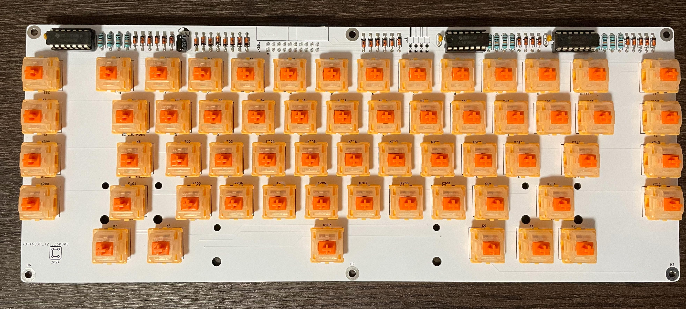

# [RO] Tastatură Custom pentru Cobra & ZX Spectrum  

Acesta este un proiect open-source pentru o tastatură mecanică compatibilă cu computerul românesc **Cobra** și alte clone **ZX Spectrum**.
Tastatura a fost proiectată pentru a fi ușor de construit, utilizând componente accesibile.  

## Caracteristici  
- **Compatibilitate:** Cobra, ZX Spectrum și clone  
- **Conexiune:** Cablu panglică 2x10, conector montat pe partea inferioară a PCB-ului
- **Componente principale:**  
  - 59 Switch-uri mecanice cu 3 pini din plastic  
  - 3 x **IC CD4066**  
  - 29 x **diode BAT42**  
  - 12 x **rezistențe 100k**  
  - 1 x **condensator 10uF**  
  - 3 x **condensator 100nF**  
  - 1 x **conector 2x10 pini**  
  - optional - 1 x **conector 2x4 pini**
- **Funcționalitate extinsă:**
  - Taste speciale pentru CP/M pe Cobra
  - Taste separate pentru: del, cursor, caps lock, edit, extended mode, "." (punct), "," (virgula), ":" (doua puncte)

## Instalare și Conectare  
1. **Montaj PCB:** Conectorul cablului panglică **trebuie montat pe partea inferioară** a PCB-ului.  
2. **Pentru Cobra:** Se conectează direct la interfața tastaturii.  
3. **Pentru ZX Spectrum și clone:** Se identifică manual liniile și coloanele din matrice și se ajustează conexiunile corespunzător. 
4. Tastatura este gândită să se potrivească pe carcasa de aici:
   - [https://www.z80-romania.ro/CoBra-64](https://www.z80-romania.ro/CoBra-64)  
   - Fișiere: [Download CoBra Case (ZIP)](https://www.z80-romania.ro/files/64/Carcasa%20CoBra%20-%20cobrasov.com%20(2024).zip?1708896374)

## Fișiere Disponibile  
- **Schematica și PCB:** Fișiere KiCad în folderul KICAD
- **Fișiere Gerber:** Pentru fabricarea PCB-ului în folderul PRODUCTION
- **BOM:** În folderul BOM
- **Grafica pentru stickere taste:** În folderul PDF
- **Schema:** În folderul PDF

## Surse și Mulțumiri  
Informațiile din acest proiect au fost inspirate și dezvoltate pe baza resurselor de la:  
- [cobrasov.com](https://cobrasov.com)  
- [CherryZXKeyboard](https://github.com/VlastimilWagner/CherryZXKeyboard)
- Și cu observații și input prețios de la [svpantazi](https://github.com/svpantazi)  

## Licență  
Acest proiect este **complet liber** pentru oricine dorește să-l folosească, modifice sau îmbunătățească.

# [EN] Custom Keyboard for Cobra & ZX Spectrum  

This is an open-source project for a mechanical keyboard compatible with the Romanian **Cobra** computer and other **ZX Spectrum clones**.  
The keyboard is designed to be easy to build, using readily available components.  

## Features  
- **Compatibility:** Cobra, ZX Spectrum, and clones  
- **Connection:** 2x10 ribbon cable, connector mounted on the **bottom side** of the PCB  
- **Main components:**  
  - 59 **mechanical switches** (3-pin plastic)  
  - 3 x **IC CD4066**  
  - 29 x **BAT42 diodes**  
  - 12 x **100k resistors**  
  - 1 x **10µF capacitor**  
  - 3 x **100nF capacitors**  
  - 1 x **2x10-pin connector**  
  - Optional: 1 x **2x4-pin connector**  
- **Extended functionality:**  
  - Special keys for CP/M on Cobra  
  - Separate keys for: Delete, Cursor, Caps Lock, Edit, Extended Mode, ".", ",", ":"  

## Installation & Connection  
1. **PCB Assembly:** The ribbon cable **must be mounted on the bottom side** of the PCB.  
2. **For Cobra:** Connects directly to the keyboard interface.  
3. **For ZX Spectrum and clones:** Manually identify the matrix rows and columns and adjust the connections accordingly.  
4. The keyboard is designed to fit in the case from:  
   - [https://www.z80-romania.ro/CoBra-64](https://www.z80-romania.ro/CoBra-64)  
   - Case files: [Download CoBra Case (ZIP)](https://www.z80-romania.ro/files/64/Carcasa%20CoBra%20-%20cobrasov.com%20(2024).zip?1708896374)

## Available Files  
- **Schematics & PCB:** KiCad files in the **KICAD** folder  
- **Gerber Files:** For PCB fabrication in the **PRODUCTION** folder  
- **BOM (Bill of Materials):** Located in the **BOM** folder  
- **Keycap Sticker Graphics:** In the **PDF** folder  
- **Schematic Diagram:** In the **PDF** folder  

## Sources & Acknowledgments  
This project was inspired and developed using information from:  
- [cobrasov.com](https://cobrasov.com)  
- [CherryZXKeyboard](https://github.com/VlastimilWagner/CherryZXKeyboard)  
- With valuable insights and feedback from [svpantazi](https://github.com/svpantazi)  

## License  
This project is **completely free** for anyone to use, modify, or improve.  
